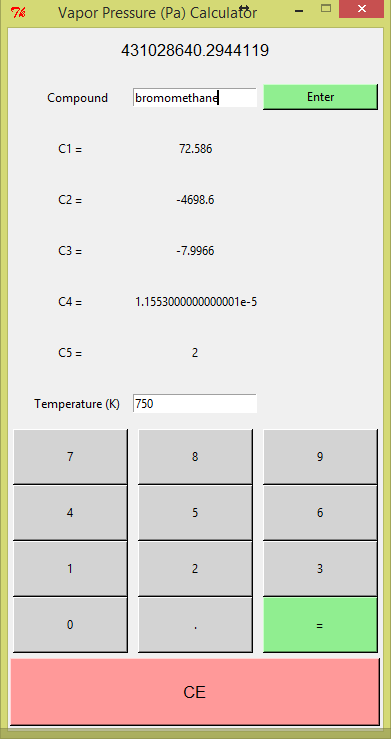
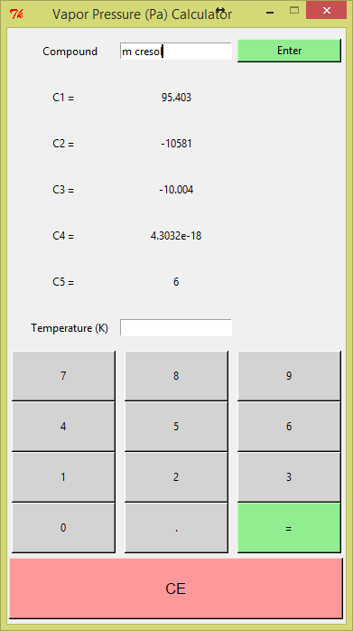

# Simple vapour pressure calculator
**Description:**

This program is used to calculate the vapour pressure of any chemical compound listed  in Perry's Handbook for Chemical 
Engineers(8th ed).

**Sample Output:**

